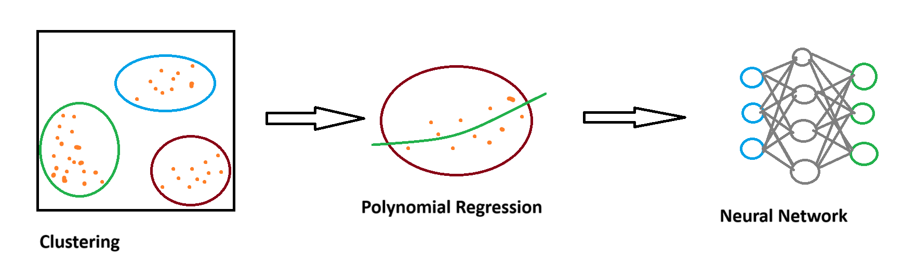

# Project Fire Watch: An Investigation into Autonomous Aerial Firefighting

## Concept
After seeing images of the wildfires in California over the weekend, I began to conceptualize a system that would allow autonomous aircraft to conduct [aerial fire fighting](https://en.wikipedia.org/wiki/Aerial_firefighting).
This system would rely on a three phase process: Detection, Planning, and Execution.

### Detection
In this phase, a clusting algorithm would be used to group hot spots (lat/long coordinates of fires) together and identify consolidated regions/corridors of fire. After some quick proof of concept testing with a kMeans model, I think a density based approach would yield results more ideal for this use case.

### Planning

In this phase, a line of best fit would be calculated for each cluster generated in the previous phase. 
This line will serve as the ideal flight path for the plane. A series of lat/long coordinates would be generated from this line and used in the next phase. For this task, I'm leaning more towards polynomial regression, than linear regression, as I think it will do a better job of minimizing the distance of a given hot spot from the flight path, as I'm anticipating the clusters to be irregulary shaped.

### Execution

In this last phase, a neural network would be trained and utilized to fly the plane along the ideal flight path. For this phase, I'm planning to write a few python scripts using the [kRPC](https://github.com/kRPC/kRPC) library to allow a neural network to flay a simulated plane in the game Kerbal Space Program. This NN would be trained, likely unsupervised, to manipulate the pitch, yaw, and roll of an aircraft to fly to the designated lat/long coordinates obtained from the previous phase.
